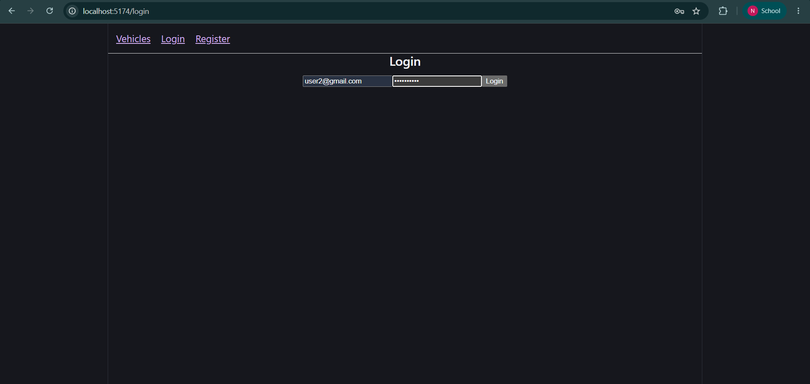
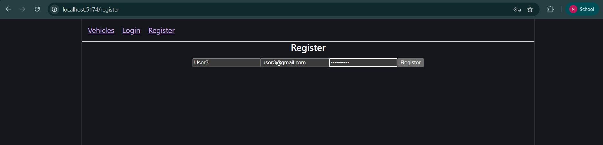
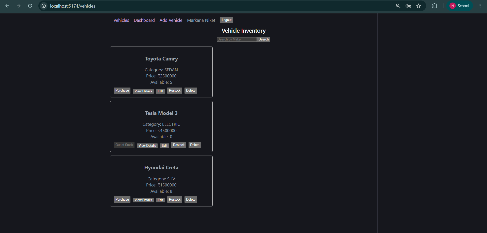
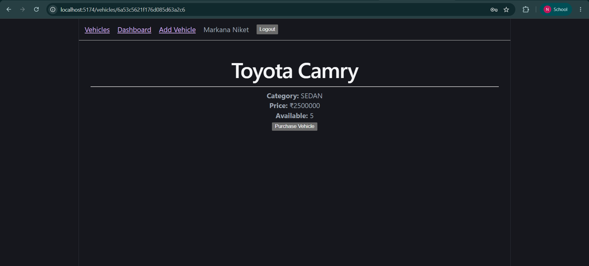
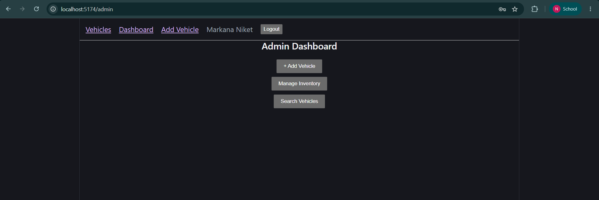
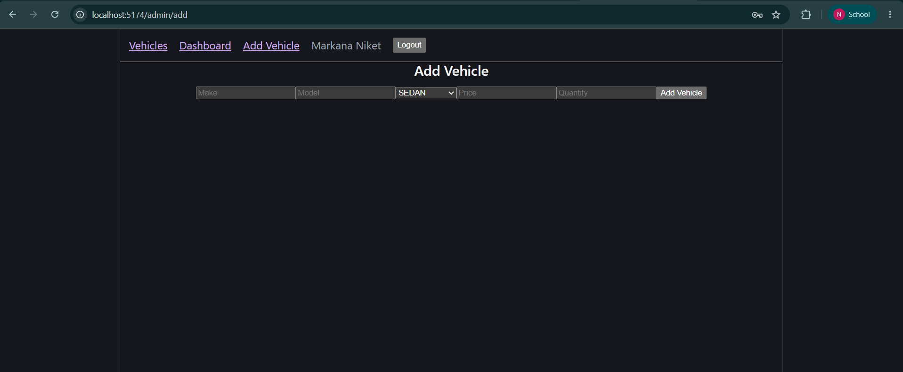
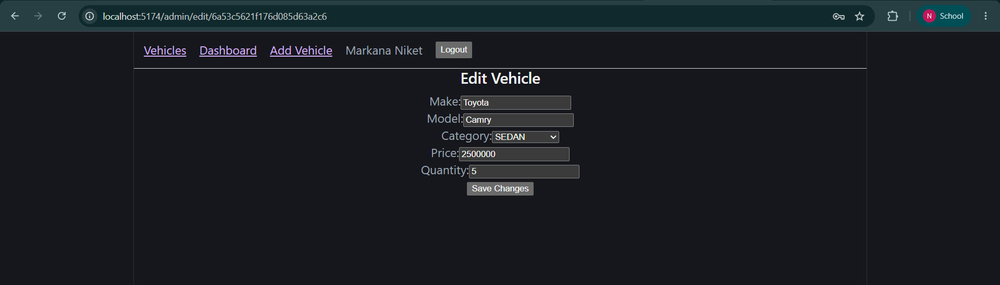
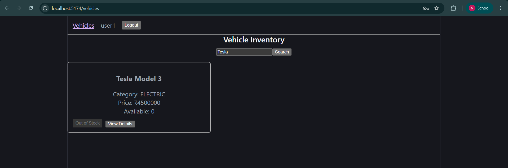

# Car Dealership Inventory System

A production-grade, full-stack Car Dealership Inventory System built following Test-Driven Development (TDD) principles. The application allows authenticated users to browse, search, purchase, and manage vehicle inventory. Administrators have additional privileges to create, update, restock, and delete vehicles.

The project follows a layered architecture (Controller -> Service -> Repository -> Model) with reusable middleware, centralized error handling, shared utilities, validations, and API response helpers.

---

## 🚀 Features

### Authentication
- User Registration
- User Login
- JWT Authentication
- Password hashing using bcrypt
- Protected Routes
- Role-based Authorization (User/Admin)

### Vehicle Inventory
- Create Vehicle
- View Vehicles
- View Vehicle Details
- Search Vehicles
- Update Vehicle
- Delete Vehicle (Admin only)
- Purchase Vehicle
- Restock Vehicle (Admin only)

### Frontend
- Login Page
- Register Page
- Vehicle Listing
- Vehicle Details Page
- Admin Dashboard
- Add Vehicle
- Edit Vehicle
- Protected Routes
- Search Functionality

### Backend
- RESTful API
- MongoDB Database
- Repository Pattern
- Service Layer
- Custom Error Handling
- Input Validation
- Modular Folder Structure

---

## 📂 Project Structure

```text
car-dealership-inventory-system/
│
├── backend/
│   ├── src/
│   │   ├── config/             # Database connection and environment setups
│   │   ├── middleware/         # Auth, NotFound, and Error Handling middlewares
│   │   ├── modules/
│   │   │   ├── auth/           # User Auth module (models, service, controller, validation)
│   │   │   └── vehicles/       # Vehicles module (models, service, controller, validation)
│   │   ├── shared/             # API response helpers, Custom Error classes, and utilities
│   │   └── server.js           # Server startup script
│   └── tests/
│       ├── integration/        # Integration tests for routes and API endpoints
│       ├── unit/               # Unit tests for business services
│       └── setup.js            # Global test configs and database hook bindings
│
└── frontend/
    ├── src/
    │   ├── api/                # Axios instance configuration and request interceptors
    │   ├── components/         # Reusable widgets (Navbar, ProtectedRoute)
    │   ├── context/            # AuthContext provider
    │   ├── pages/              # Views (Login, Register, Dashboard, Vehicles list, Details, Forms)
    │   ├── App.jsx             # Main Router settings
    │   └── main.jsx            # React root container mounting
```

---

## 🛠️ Technologies Used

| Category | Technology |
| :--- | :--- |
| **Backend** | Node.js, Express.js |
| **Frontend** | React, Vite |
| **Database** | MongoDB with Mongoose |
| **Testing** | Jest, Supertest |
| **Authentication** | JWT, bcrypt |
| **Validation** | express-validator |

---

## 🔌 REST API Endpoints

### Authentication

| Endpoint | Method | Security | Description |
| :--- | :--- | :--- | :--- |
| `/api/auth/register` | `POST` | Public | Register a new user account (defaults to USER role). |
| `/api/auth/login` | `POST` | Public | Authenticate user credentials and return a signed JWT token. |

### Vehicles & Inventory

| Endpoint | Method | Security | Description |
| :--- | :--- | :--- | :--- |
| `/api/vehicles` | `GET` | User / Admin | Retrieve a list of all available vehicles in the catalog. |
| `/api/vehicles/:id` | `GET` | User / Admin | Retrieve specifications and stock details for a single vehicle. |
| `/api/vehicles/search` | `GET` | User / Admin | Filter vehicles by make (case-insensitive query search). |
| `/api/vehicles` | `POST` | Admin Only | Add a new vehicle to the inventory. |
| `/api/vehicles/:id` | `PUT` | Admin Only | Update vehicle fields (make, model, category, price, quantity). |
| `/api/vehicles/:id` | `DELETE` | Admin Only | Delete a vehicle from the catalog. |
| `/api/vehicles/:id/purchase` | `POST` | User / Admin | Purchase a vehicle, decreasing its available stock count by 1. |
| `/api/vehicles/:id/restock` | `POST` | Admin Only | Restock a vehicle, increasing its available stock count by custom quantity. |

---

## ⚙️ Installation

### Prerequisites
- Node.js (v18+)
- Local MongoDB installation or MongoDB Atlas Connection String

### Clone Repository
```bash
git clone <repository-url>
cd car-dealership-inventory-system
```

### Install Backend Dependencies
```bash
cd backend
npm install
```

### Install Frontend Dependencies
```bash
cd ../frontend
npm install
```

### Create Environment Files
Configure the `.env` file in the `backend/` directory using the provided `env.example` configurations.

### Run Backend Server
```bash
cd backend
npm run dev
```

### Run Frontend Client
```bash
cd ../frontend
npm run dev
```

---

## 🧪 Testing

The backend development follows Test-Driven Development (TDD) principles:
1. Write failing integration and unit test scenarios representing requirements.
2. Implement backend services to satisfy tests.
3. Refactor business logic for speed, readability, and security guidelines.

To run the test suites and check code coverage:
```bash
cd backend
npm test
```

We have **40+ passing tests** covering the API layer, service business logic, validation bounds, and password processing:
- **Unit Tests:** Verify business logic rules in the Service layer (auth registration, role assignment, stock checks, purchase limits).
- **Integration Tests:** Verify endpoint HTTP codes, validation pipeline flow, and authorization assertions.
- **Coverage:** Reaches **~94%** line and statement coverage.

---

## 🖼️ Screenshots

- **Login Page**
  
- **Register Page**
  
- **Vehicle Dashboard**
  
- **Vehicle Details**
  
- **Admin Dashboard**
  
- **Add Vehicle**
  
- **Edit Vehicle**
  
- **Inventory Search**
  

---

## 🔄 TDD Workflow

This project adheres strictly to the **Red-Green-Refactor** loop:
- **Red:** Tests are written first in `tests/unit/` or `tests/integration/` specifying target expectations, asserting fail bounds.
- **Green:** Minimum clean codebase structures are implemented to satisfy the tests.
- **Refactor:** Code is audited to extract duplicate logic, format styles, optimize mongoose database queries, and fix lint warnings.

This cycle is reflected clearly in clean, feature-driven commits showing unit/integration suites preceding implementation.

---

## 🐙 Git Workflow

- **Feature-based Commits:** Code is committed in bite-sized, logical blocks (e.g. `feat(auth)`, `feat(vehicle)`, `test(auth)`).
- **Descriptive Commits:** Commits explain modifications and structural designs.
- **Rebase Workflow:** Clean, linear histories are maintained using interactive rebase rebinding.

---

## 🤖 My AI Usage

This project was built with active pair-programming collaboration using AI assistance.

### Tools Used
- **ChatGPT**
- **Antigravity AI** (Powered by Gemini)

### How they were used
- **Boilerplate Scaffolding:** Scaffolded initial modular controller-service-repository files, express router wrappers, and validation parameters.
- **Architecture brainstorming:** Consulted on optimal folder structures, error middleware positioning, and validation hooks.
- **Test Generation:** Assisted in drafting test suites covering edge cases (such as token validation failures, database validation blocks, and negative stocking quantities).
- **Debugging & Rebasing:** Helped trace and correct interactive git rebase conflicts, ESLint variables warnings, and React hook dependencies.
- **Documentation:** Assisted in generating Markdown layouts and formatting reports.

> "Every AI-generated suggestion was reviewed, modified where necessary, tested locally, and integrated manually."

### Reflection
The collaboration with AI assistants significantly accelerated bootstrapping and unit test generation. While the AI successfully generated boilerplate structures, all final architectural decisions, API security boundaries, custom error designs, database schema constraints, and manual verifications remained entirely my responsibility to ensure software craftsmanship standards.

---

## 🔮 Future Improvements

- **Responsive CSS Layouts:** Incorporate a comprehensive styled component grid or custom stylesheets.
- **Vehicle Images:** Allow uploading and storing vehicle image banners using Cloudinary or AWS S3.
- **Pagination & Sorting:** Add cursor-based pagination and dynamic sorting options (price, date) to vehicles queries.
- **Dashboard Analytics:** Display monthly sales charts, purchase metrics, and restocking summaries.
- **CI/CD Pipeline:** Configure automatic GitHub Actions to run Jest tests and build check pipelines on push.

---

## 👤 Author

- **Name:** Markana Niket
- **GitHub:** [GitHub Profile](https://github.com/NiketMarkana)
